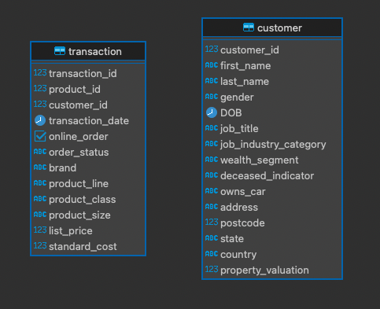

# Основные операторы PostgreSQL (vo_HW)

Таблицы созданы средствами DBeaver, данные вставлены средствами DBeaver.




## Задание 1
Вывести все уникальные бренды, у которых стандартная стоимость выше 1500 долларов.

Запрос:
```postgresql
SELECT DISTINCT brand
FROM transaction
WHERE standard_cost > 1500;
```

Результат:

| brand |
| :--- |
| OHM Cycles |
| Trek Bicycles |
| Solex |
| Giant Bicycles |

## Задание 2
Вывести все подтвержденные транзакции за период '2017-04-01' по '2017-04-09' включительно.

Запрос:
```postgresql
SELECT *
FROM transaction
WHERE order_status = 'Approved' AND transaction_date BETWEEN '2017-04-01' AND '2017-04-09'
ORDER BY transaction_date;
```

Результат (Первые 5 строчек):

| transaction\_id | product\_id | customer\_id | transaction\_date | online\_order | order\_status | brand | product\_line | product\_class | product\_size | list\_price | standard\_cost |
| :--- | :--- | :--- | :--- | :--- | :--- | :--- | :--- | :--- | :--- | :--- | :--- |
| 1911 | 0 | 1109 | 2017-04-01 00:00:00.000000 | true | Approved | Norco Bicycles | Road | medium | medium | 543.39 | 407.54 |
| 126 | 53 | 773 | 2017-04-01 00:00:00.000000 | false | Approved | OHM Cycles | Standard | medium | medium | 795.34 | 101.58 |
| 83 | 0 | 3398 | 2017-04-01 00:00:00.000000 | true | Approved | OHM Cycles | Standard | medium | medium | 235.63 | 125.07 |
| 1044 | 54 | 1839 | 2017-04-01 00:00:00.000000 | true | Approved | WeareA2B | Standard | medium | medium | 1807.45 | 778.69 |
| 1930 | 69 | 2318 | 2017-04-01 00:00:00.000000 | true | Approved | Giant Bicycles | Road | medium | medium | 792.9 | 594.68 |

## Задание 3
Вывести все профессии у клиентов из сферы IT или Financial Services, которые начинаются с фразы 'Senior'.

Запрос:
```postgresql
SELECT job_title
FROM customer
WHERE job_title LIKE 'Senior%' AND (job_industry_category = 'IT' OR job_industry_category = 'Financial Services');
```

Результат (Первые 5 строчек):

| job\_title |
| :--- |
| Senior Quality Engineer |
| Senior Cost Accountant |
| Senior Financial Analyst |
| Senior Financial Analyst |
| Senior Sales Associate |


## Задание 4
Вывести все бренды, которые закупают клиенты, работающие в сфере Financial Services

Запрос:
```postgresql
SELECT DISTINCT brand
FROM transaction
JOIN customer ON transaction.customer_id = customer.customer_id
WHERE job_industry_category = 'Financial Services' AND brand IS NOT NULL;
```

Результат:

| brand |
| :--- |
| OHM Cycles |
| Trek Bicycles |
| WeareA2B |
| Solex |
| Norco Bicycles |
| Giant Bicycles |


## Задание 5
Вывести 10 клиентов, которые оформили онлайн-заказ продукции из брендов 'Giant Bicycles', 'Norco Bicycles', 'Trek Bicycles'.

Запрос:
```postgresql
SELECT customer.customer_id, first_name, last_name, brand, online_order
FROM transaction
JOIN customer ON transaction.customer_id = customer.customer_id
WHERE online_order = true AND brand IN ('Giant Bicycles', 'Norco Bicycles', 'Trek Bicycles')
LIMIT 10;
```

Результат:

| customer\_id | first\_name | last\_name | brand | online\_order |
| :--- | :--- | :--- | :--- | :--- |
| 3120 | Lauree | O'Donnell | Trek Bicycles | true |
| 787 | Norma | Batrim | Giant Bicycles | true |
| 2339 | Damien | Haddeston | Giant Bicycles | true |
| 1243 | Robbert | Blakey | Trek Bicycles | true |
| 3002 | Tracey | Verdun | Giant Bicycles | true |
| 2666 | Lyle | Eager | Trek Bicycles | true |
| 3368 | Tanya | Boddis | Norco Bicycles | true |
| 2810 | Malvin | Burchill | Norco Bicycles | true |
| 2003 | Lilli | Hargey | Trek Bicycles | true |
| 2448 | Lorri | Iston | Norco Bicycles | true |


## Задание 6
Вывести всех клиентов, у которых нет транзакций.

Запрос:
```postgresql
SELECT customer_id, first_name, last_name
FROM customer
WHERE customer_id NOT IN (SELECT customer_id FROM transaction);
```

Результат (Первые 5 строчек):

| customer\_id | first\_name | last\_name |
| :--- | :--- | :--- |
| 852 | Andie | Bonney |
| 869 | Addia | Abels |
| 1373 | Shaylynn | Epsley |
| 2074 | Roslyn | Rawdall |
| 2660 | Hunt | Scollard |


## Задание 7
Вывести всех клиентов из IT, у которых транзакции с максимальной стандартной стоимостью.


Запрос:
```postgresql
SELECT customer.customer_id, first_name, last_name, job_industry_category,  standard_cost
FROM transaction
JOIN customer ON transaction.customer_id = customer.customer_id
WHERE job_industry_category = 'IT' AND standard_cost = (
    SELECT MAX(standard_cost)
    FROM transaction
);
```

Результат:

| customer\_id | first\_name | last\_name | job\_industry\_category | standard\_cost |
| :--- | :--- | :--- | :--- | :--- |
| 3473 | Sanderson | Alloway | IT | 1759.85 |
| 893 | Gibby | Fearnley | IT | 1759.85 |
| 3151 | Thorn | Choffin | IT | 1759.85 |
| 34 | Jephthah | Bachmann | IT | 1759.85 |
| 2913 | Padraic | Bonnar | IT | 1759.85 |
| 1918 | Devin | Sandeson | IT | 1759.85 |
| 1672 | Sharla | Creebo | IT | 1759.85 |
| 975 | Goldarina | Rzehorz | IT | 1759.85 |
| 1773 | Nickolas | Guittet | IT | 1759.85 |


## Задание 8
Вывести всех клиентов из сферы IT и Health, у которых есть подтвержденные транзакции за период '2017-07-07' по '2017-07-17'.

Запрос:
```postgresql
SELECT customer.customer_id, first_name, last_name, job_industry_category, transaction_date, order_status
FROM transaction
JOIN customer ON transaction.customer_id = customer.customer_id
WHERE job_industry_category IN ('IT', 'Health') AND order_status = 'Approved' AND transaction_date BETWEEN '2017-07-07' AND '2017-07-17'
ORDER BY transaction_date;
```

Результат (Первые 5 строчек):

| customer\_id | first\_name | last\_name | job\_industry\_category | transaction\_date | order\_status |
| :--- | :--- | :--- | :--- | :--- | :--- |
| 2684 | Erastus | Payley | Health | 2017-07-07 00:00:00.000000 | Approved |
| 350 | Carmela | Jesper | Health | 2017-07-07 00:00:00.000000 | Approved |
| 3288 | Fair | Dewen | IT | 2017-07-07 00:00:00.000000 | Approved |
| 3173 | Angelo | null | Health | 2017-07-07 00:00:00.000000 | Approved |
| 300 | Malachi | Hadcroft | Health | 2017-07-07 00:00:00.000000 | Approved |
